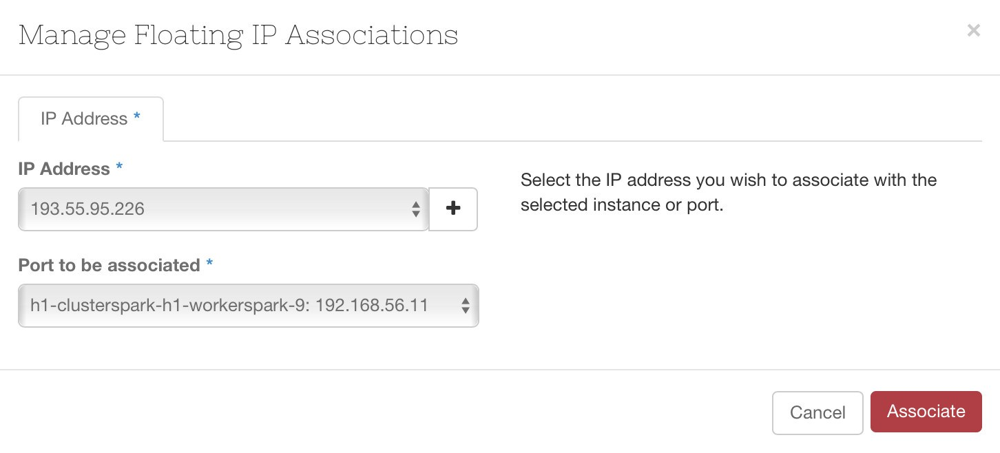

# Concept

Les floating IP sont des IP publiques que l'on peut associer à l'interface d'une VM afin de pourvoir accéder à la VM depuis l'extérieur.

# Mise en oeuvre

A partir du menu déroulant choisir l'option 'Associate Floating IP'.

Choisir l'IP à associer, cliquez sur 'Associate'.

La VM est désormais accessible via la floating IP depuis l'extérieur.

