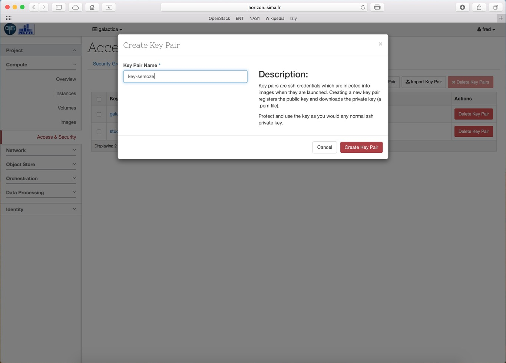
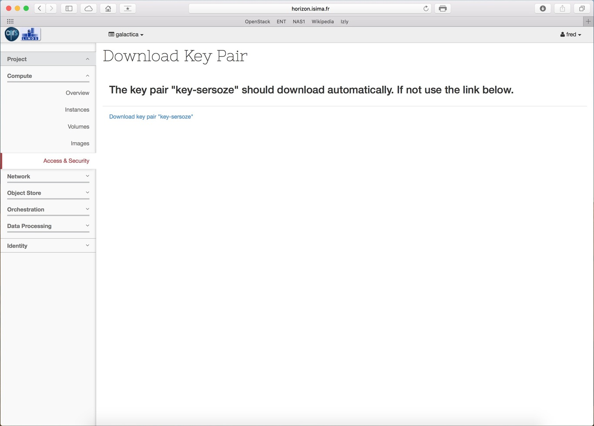

# Création
Initialement, l'accès aux VM se fait par clé privée SSH. Avant de lancer votre première VM il est donc nécessaire de créer votre propre paire de clé, ou d'importer une clé publique existante. Ici, nous allons créer notre propre jeu de clé. Ouvrez le menu 'Access&security', puis cliquez sur l'onglet 'Key Pair', puis sur le bouton 'Create Key Pair'.

Saisissez un nom, puis cliquez sur 'Create Key pair'.

# Téléchargement

Le téléchargement de la clé privée s'effectue automatiquement. Dans le cas contraire, cliquez sur le lien affiché sur la page.

#La clé privée n'est pas stockée sur la plateforme, si vous la perdez, personne ne pourra vous vous la restituer.

Lorsqu'une VM est instanciée, un processus (cloud-init) installé dans l'image de la VM va récupérer la clé et l'installer dans le fichier '.ssh/authorized_keys' d'un user particulier. Ainsi il suffira de lancer la commande suivante pour se connecter :

ssh -i key-sersoze username@XX.XX.XX.XX
Le username utilisé depend de la distribution. Sur ubuntu, le user est 'ubuntu'. Pour les distributions centos il s'agit de 'cloud-user' ou bien de 'centos' selon les versions. Si vous utilisez d'autres types d'images, il faudra alors rechercher quel est le user par défaut.