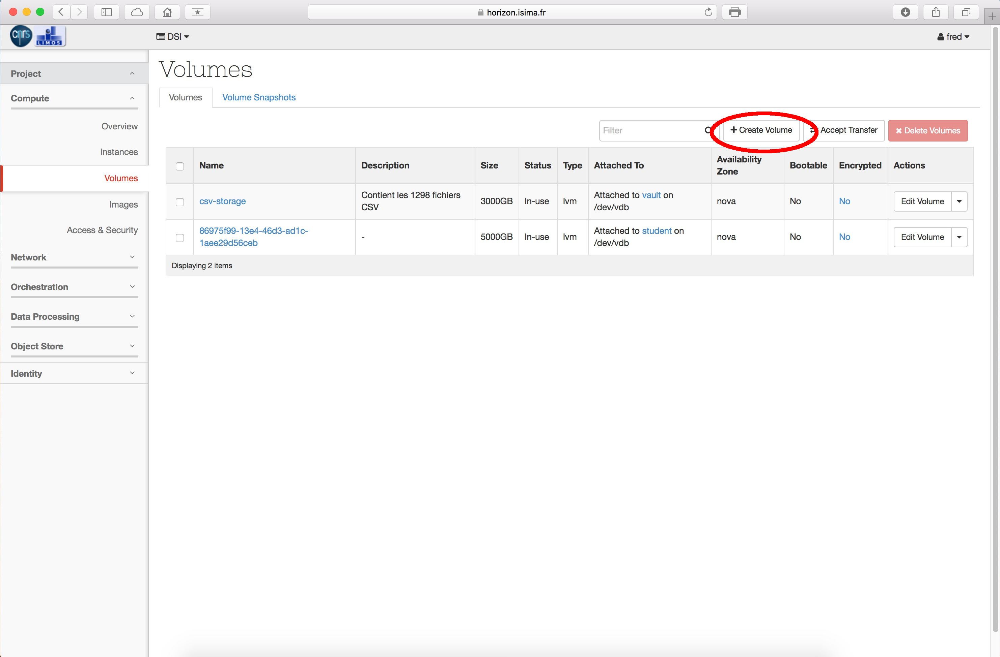
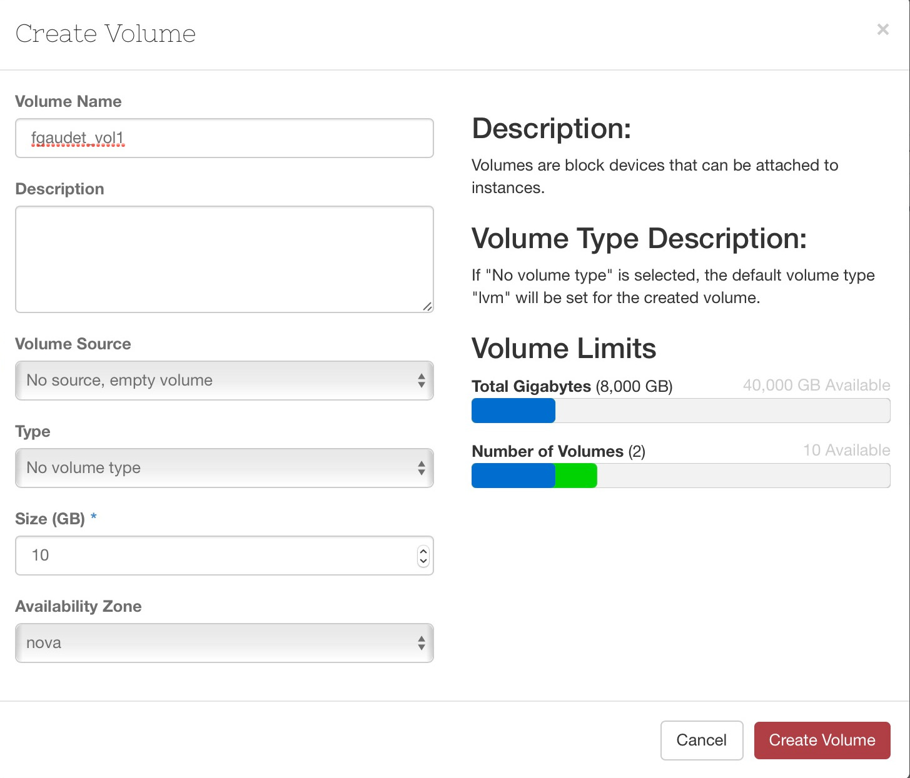

# Création

Pour créer un volume, il suffit de cliquer sur le bouton 'Create volume'.

Peu d'informations à saisir dans l'écran suivant : citons principalement le nom que vous allez donner au volume, ainsi que sa taille. Aujourd'hui nous n'avons qu'un seul backend de stockage, nous laissons donc les autres paramètres avec leur valeur par défaut.

# Attachement

Maintenant que notre volume est créé, vous voulez certainement l'attacher à une VM. Ouvrez le menu, et choisissez l'option 'Manage attachement'.

Sélectionnez la VM à laquelle vous allez attacher le volume dans la liste déroulante. Notez que vous ne pouvez attacher votre volume qu'à une seule VM à la fois.

Si tout se passe bien, l'interface indique que le statut du volume est 'In-use' et le nom du périphérique utilisé sur la VM. Ici /dev/vdb.

