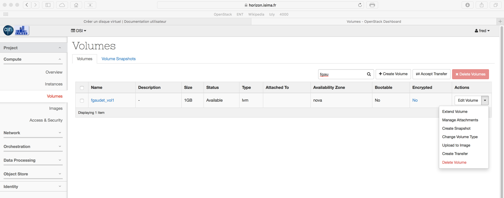
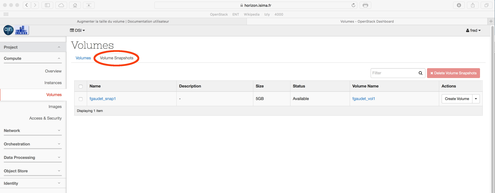

# Avertissement
Pensez avant toute opération sur les volumes à démonter le disque depuis votre VM.

Exemple : `sudo umount /dev/vdb`

Cette commande ne peut fonctionner que si aucun processus n'utilise cette ressource.

# Détacher le volume

Après avoir démonté votre volume depuis votre VM, procédez au détachement via le menu contextuel.

# Créer le snapshot

Puis, cliquez sur 'Create snapshot' toujours depuis le menu contextuel.

Indiquez le nom du snapshot, et cliquez sur 'Create Volume Snapshot'

Le temps de traitement peut être important selon la taille du volume. Soyez patient :) A l'issue du transfert, le volume apparait dans l'onglet 'Snapshot'.

Vous pouvez maintenant attacher le volume, le monter et l'utiliser de nouveau.