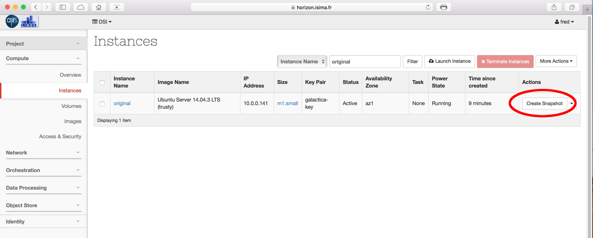

# Introduction

Comment ajouter automatiquement un user lors de l'instanciation d'une VM ? C'est facile à réaliser grâce à cloud-init. Il va sans dire qu'il convient de prendre toutes les précautions quant au choix du mot de passe si la VM est directement accessible depuis l'extérieur....

# Créer un hash

Tout d'abord, installer l'utilitaire makepasswd afin de générer le hash qui va bien :

`fgaudet@pclimos135:~$ sudo apt-get install makepasswd`

Ensuite, générer un hash de votre mot de passe, ici c'est 'montmotdepasse' :

	fgaudet@pclimos135:~$ makepasswd --clearfrom=- --crypt-md5 <<< monmotdepasse
	monmotdepasse $1$GwZT4duo$guq9frwju6IMrz5rBCxIH0

Ensuite placez le hash du mot de passe ainsi récupéré dans le script yaml dont voici un exemple ci-dessous.

Ne tentez pas de placer un mot de passe au user 'root', pour des raisons de sécurité les images sont configurées de telle sorte que le user root ne peut pas se connecter en SSH avec un password. Vous devez créer un user lamdba, qui éventuellement peut devenir root via sudo.

# Créer le script

	#cloud-config
	 users:
	 - default
	 - name: fred
	   gecos: fred
	   groups: sudo
	   sudo: ALL=(ALL) ALL
	   shell: /bin/bash
	   lock-passwd: false
	   passwd: $1$GwZT4duo$guq9frwju6IMrz5rBCxIH0

Quelques explications :

* default : indique à cloud-init que le user par défaut (par ex. ubuntu pour les images d'Ubuntu) sera créé en sus,
* name : username,
* gecos : nom complet de l'utilisateur,
* groups : groupes dont le user fait partie,
* sudo : ici le user fred pourra passer des commandes en utilisant sudo,
* shell : shell à exécuter par défaut
* lock-password : Si false, permet à un user de se logger grâce à un password
* passwd : le hash du password

Plus d'infos sur la doc officielle [ici](https://cloudinit.readthedocs.org/en/latest/).