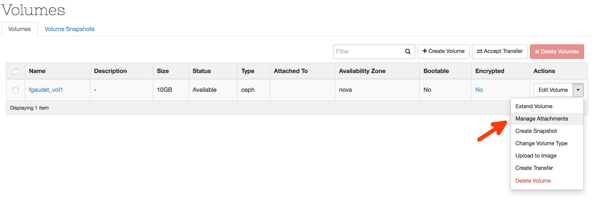

# Création

Pour créer un volume, il suffit de cliquer sur le bouton 'Create volume'.

Peu d'informations à saisir dans l'écran suivant : citons principalement le nom que vous allez donner au volume, sa taille et enfin le type de stockage. Ces derniers sont au nombre de deux :

* ceph
* ceph-noreplica

Le type 'ceph' pointe sur un pool répliqué sur le cluster de stockage, alors que le type 'ceph-noreplica' comme son nom l'indique pointe sur un pool non répliqué sur le même cluster. Ainsi vous bénéficiez du maximum d'espace disque disponible, mais sans sécurité.

# Attachement

Maintenant que notre volume est créé, vous voulez certainement l'attacher à une VM. Ouvrez le menu, et choisissez l'option 'Manage attachement'.

Sélectionnez la VM à laquelle vous allez attacher le volume dans la liste déroulante. Notez que vous ne pouvez attacher votre volume qu'à une seule VM à la fois.

Si tout se passe bien, l'interface indique que le statut du volume est 'In-use' et le nom du périphérique utilisé sur la VM. Ici /dev/vdb.

A présent, connectez vous sur votre VM et ...

* formatez le disque,
* montez le disque,
* utilisez le disque :)

# Conseil

Pensez à démonter le disque de votre VM avant d'effectuer des opérations (resize, detach). Sinon vous risquez de compromettre l'intégrité des données.