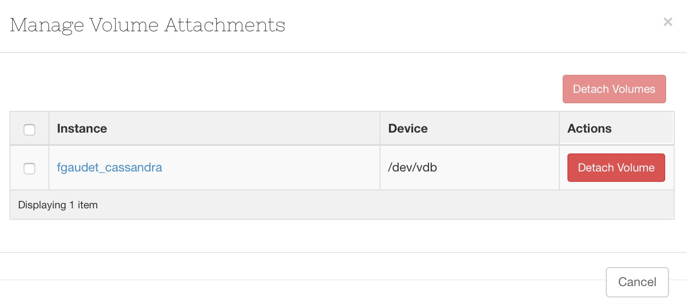

# Avertissement
Pensez avant toute opération sur les volumes à démonter le disque depuis votre VM.

Exemple : `sudo umount /dev/vdb`

Cette commande ne peut fonctionner que si aucun processus n'utilise cette ressource.

# Détacher le volume

Après avoir démonté votre volume depuis votre VM, procédez au détachement via le menu contextuel.

# Augmenter la taille

Puis, cliquez sur 'Extend Volume' toujours depuis le menu contextuel.

Indiquez la nouvelle taille du disque, et cliquez sur 'Extend Volume'.

Après un léger temps de traitement, le volume est disponible avec la nouvelle taille spécifiée.

Vous pouvez maintenant attacher le volume, le monter et l'utiliser.