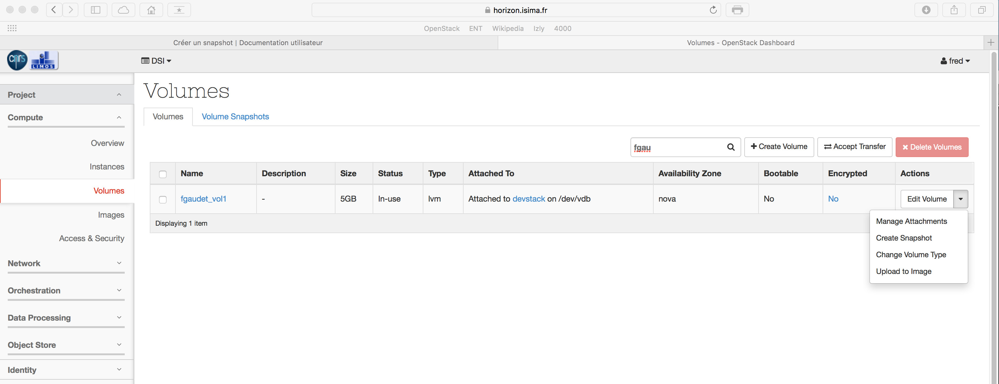
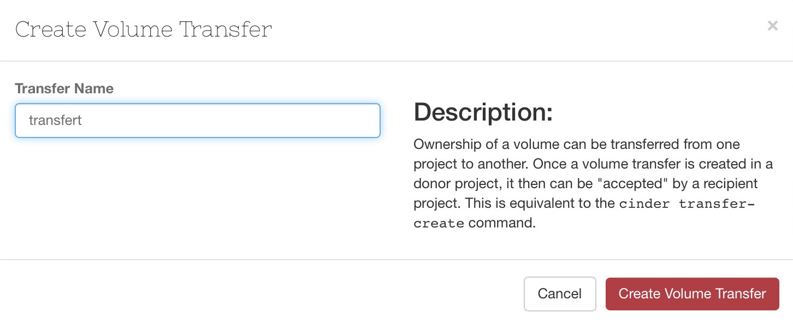
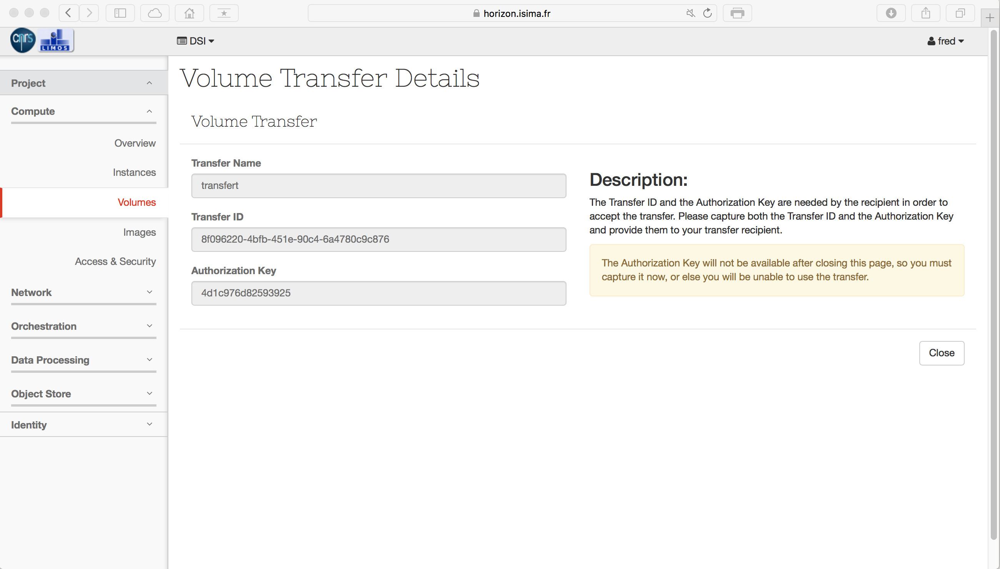
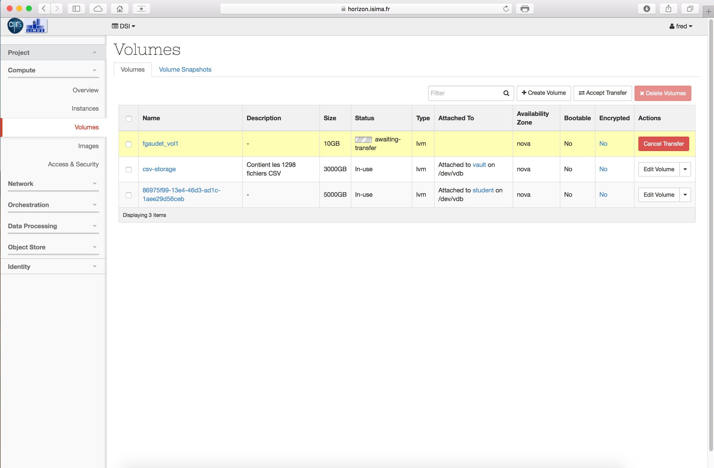
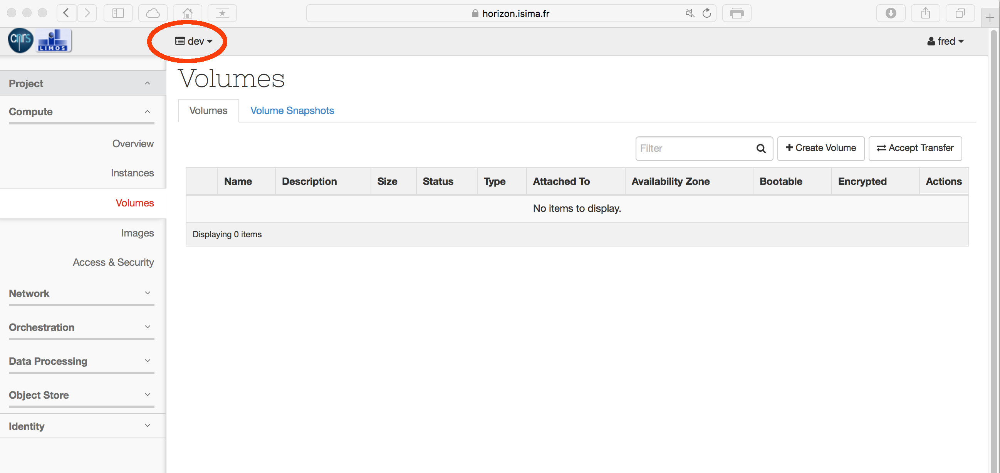
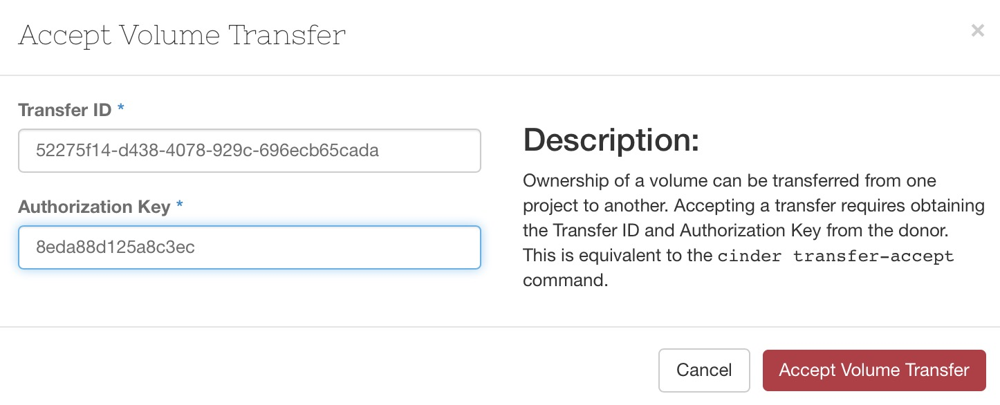
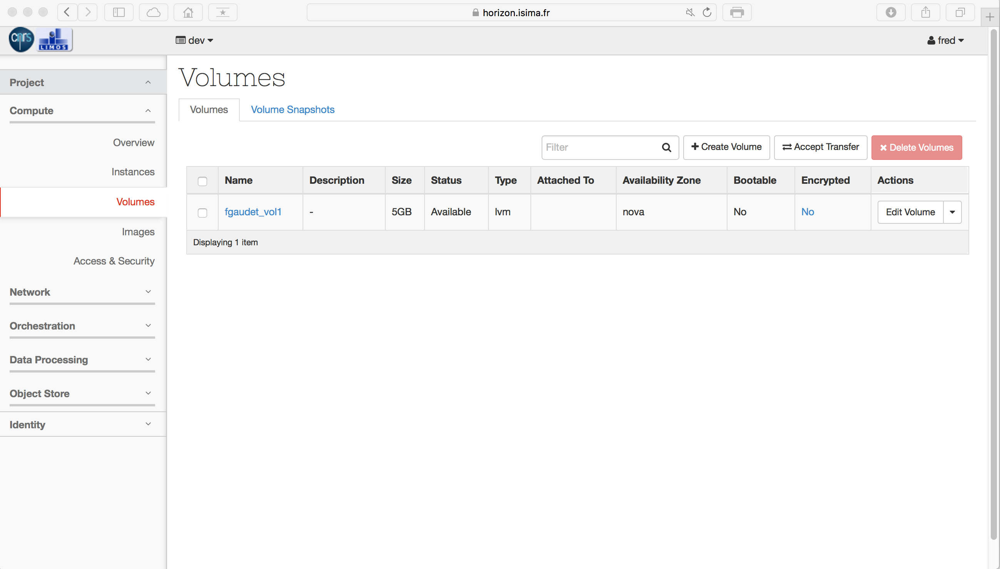

# Le concept

La plateforme offre une ségrégation par projet. Toutes les ressources allouées au sein d'un projet sont invisibles aux autres projets de la même plateforme. Vous pouvez cependant transférer un volume d'un projet vers un autre.

Le principe est d'accompagner le transfert d'une clé de sécurité. Le destinataire devra renseigner cette clé afin de récupérer le disque.

# Mise en oeuvre

## Détacher le volume

Après avoir démonté votre volume depuis votre VM, procédez au détachement via le menu contextuel.

## Créer le transfert
Depuis le menu contextuel accessible à partir de l'écran de gestion des modules, choisir l'option 'Create Transfert'. Donnez un identifiant à cette opération.

Cliquez sur 'Create Volume Transfert'

Sur l'écran suivant, notez précieusement le 'Transfert ID' ainsi que l'Autorization key', et communiquez les à la personne à qui vous souhaitez transférer le volume.

Le volume est désormais en attente de transfert, comme indiqué sur la capture ci-dessous :

Côté destinataire, qui ici est le projet appelé 'dev', cliquez sur le bouton 'Accept transfert' situé sur l'écran principal de gestion des volumes.

Renseignez le 'Transfert ID' ainsi que l'Authorization Key' et validez.

Le volume est désormais disponible :

