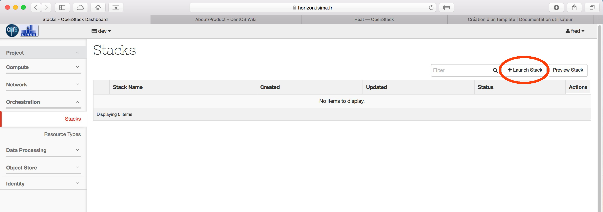
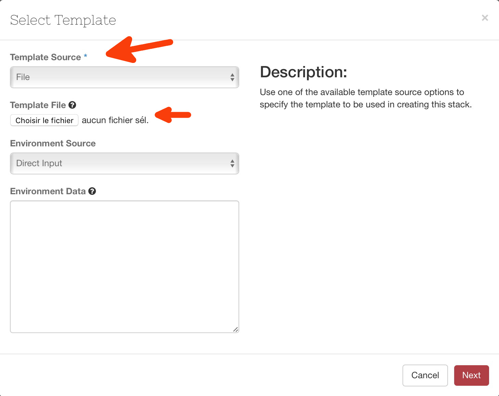
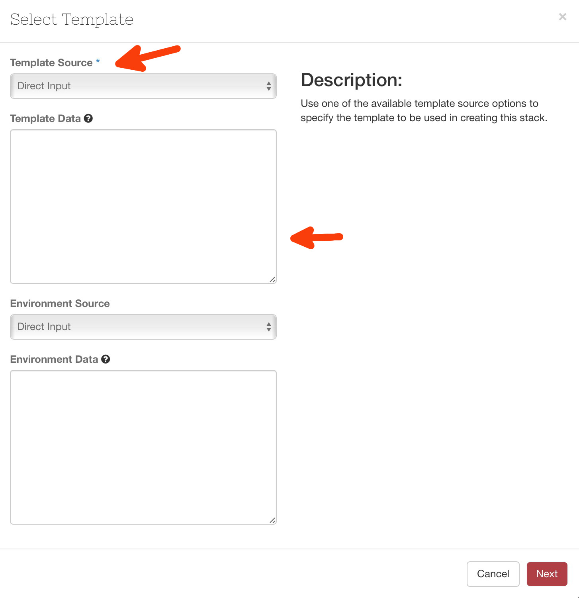
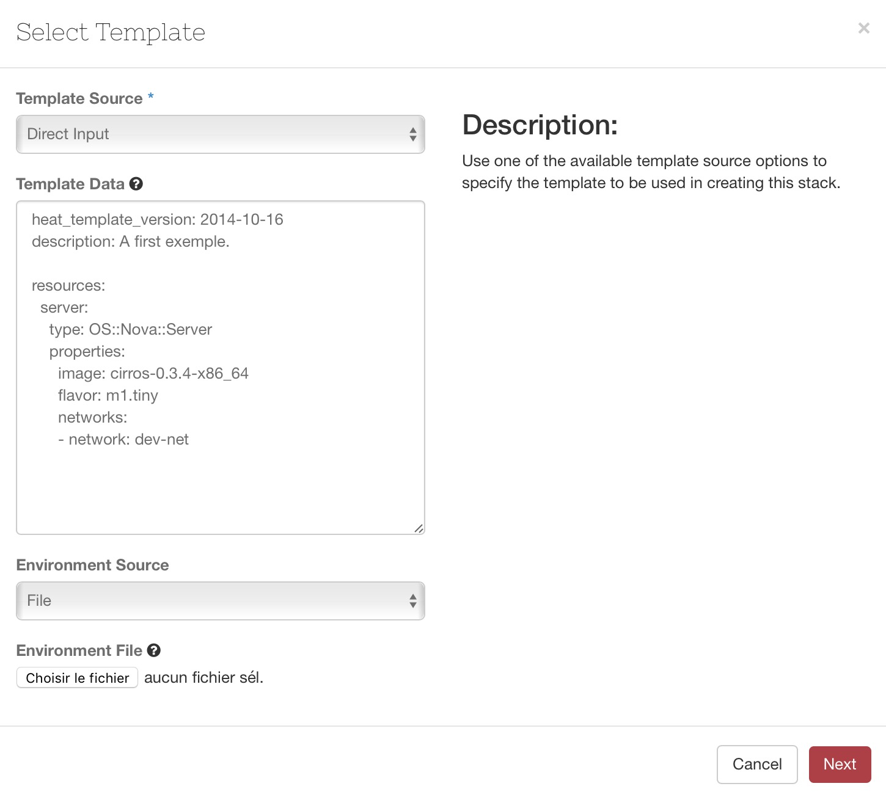
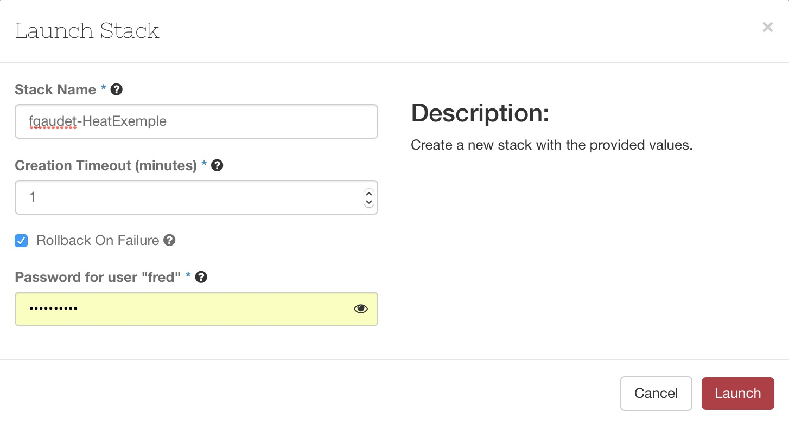
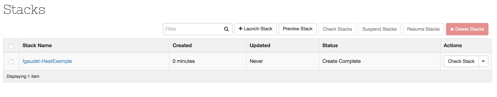
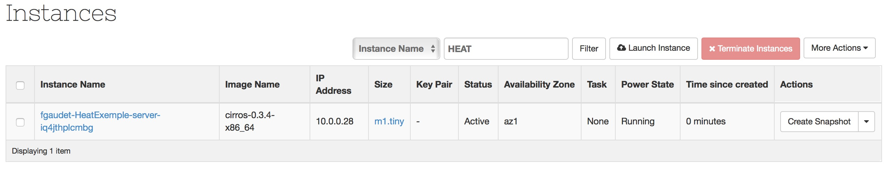
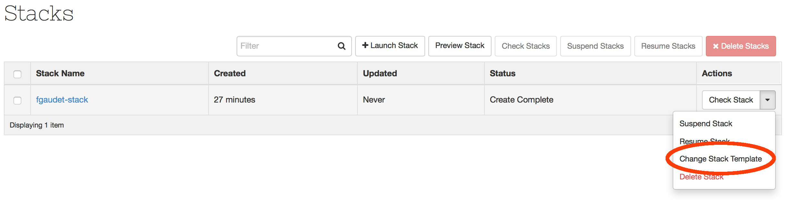
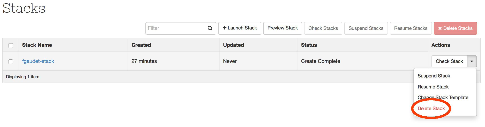

Une fois votre template défini, comment l'exécuter sur la plateforme ? Comme toujours, deux possibilités s'offent à vous : soit par l'interface web ou bien en ligne de commande.

# Lancement via l'interface web

 Une fois identifié, naviguez dans le menu 'Orchestration' puis, cliquez sur le bouton 'Launch Stack'.

 

L'interface web permet d'utiliser soit un fichier préalablement construit...

...soit de saisir directement le template dans une zone de dialogue.

La section 'environnement' vous permet de saisir les paramètres, si votre template en nécessite.

Voici un exemple avec le template défini au chapitre précédent, que j'insère directement dans le formulaire :

Cliquez ensuite sur 'Next'. Choisissez un nom pour votre stack, et indiquez le temps maximal que vous estimez nécessaire pour la création de votre infrastructure.

Cliquez sur 'Launch' :

Vous pouvez consulter la page 'Instance' afin de vérifier la bonne création de notre VM :

# Lancement par l'API

Afin de réaliser l'action équivalente par l'API, copiez le template dans un fichier que nous allons appeler ici `heat_exemple_01.yml`.

La syntaxe est `heat stack-create -f <fichier> <stack_name>`

 heat stack-create -f heat_exemple_01.yml fgaudet-stack

+--------------------------------------+---------------+--------------------+---------------------+--------------+
| id                                   | stack_name    | stack_status       | creation_time       | updated_time |
+--------------------------------------+---------------+--------------------+---------------------+--------------+
| 920a154f-3294-497f-b4ba-ebe2aaec321b | fgaudet-stack | CREATE_IN_PROGRESS | 2016-04-28T14:24:21 | None         |
+--------------------------------------+---------------+--------------------+---------------------+--------------+

# Modification

Modifier un stack revient à changer son modèle descriptif. A partir du menu contextuel, il est possible de modifier le template, suivant les même actions effectuées lors de la création.

# Destruction

La destruction d'un stack se fait via le menu contextuel du stack.

