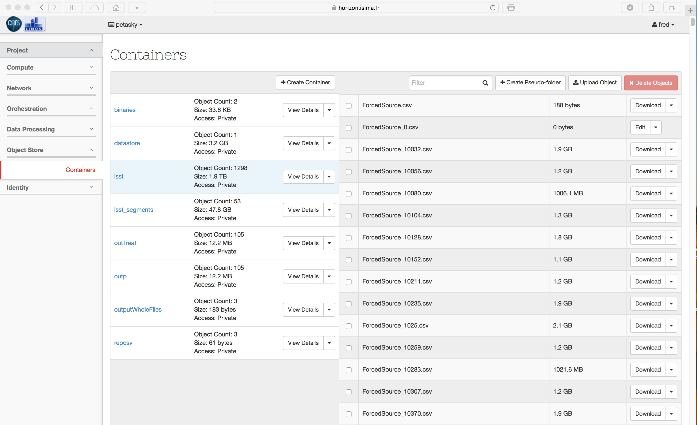

# Mais où sont les jeux de données ?

Vous souhaitez utiliser les jeux de données de la plateforme à des fins d'expérimentation. Plusieurs jeux se trouvent dans l'object store. Par exemple, les données LSST sont placées dans un container appelé... lsst. Voyons comment les intégrer dans vos propres VM.

Remarque : dans la capture d'écran présentée ici, on voit qu'il existe un container 'lsst' et un autre appelé 'lsst_segments'. Lorsque vous uploadez un fichier plus volumineux que 5Go, alors il est divisé en segments plus petits dans un autre container dont le suffixe est 'segments'.
Lorsque vous downloadez les objets, le client swift rassemble les morceaux de manière transparente pour l'utilisateur.

# Comment exploiter les données ?

## Sur une VM standard

Afin de rapatrier les données et les exploiter sur des outils comme des bases de données relationnelles, il faut au préalable avoir créé vos VM avec suffisamment de stockage.

Connectez-vous sur une de vos VM et installez le client permettant d'accéder à l'object store.

Debian like :

sudo apt-get -y install python-swiftclient

Red hat like :

sudo yum -y install python-swiftclient

Munissez vous des paramètres suivants :

* Username swift (qui est le même que votre login galactica)
* Password swift (qui est le même que votre password galactica)
* Le nom du projet, par exemple `petasky`
* Container swift, par exemple `lsst`

Lancez le download :

swift --os-tenant-name petasky \
	  --os-region-name RegionOne \
	  --os-username fred  \
	  --os-password ******** \
	  --os-auth-url https://api.isima.fr:5000/v2.0 \
	  download lsst [object]

Si vous spécifiez simplement le nom du container, tout le contenu dudit container sera téléchargé. Si vous spécifiez un nom d'objet, seul ce dernier sera téléchargé.

## Sur un cluster Hadoop ou Spark

Dans le cas de cluster de type Hadoop, vous souhaitez généralement importer les données dans HDFS. Cela peut se faire directement, l'opération est assez simple. [Après avoir créé votre cluster](../sahara/cluster.html "Créer un cluster"), affectez une floating IP et connectez vous dessus.

Munissez vous des paramètres suivants :

* Username swift (qui est le même que votre login galactica)
* Password swift (qui est le même que votre password galactica)
* Le nom du projet, par exemple `petasky`
* Container swift, par exemple `lsst`
* Nom du répertoire HDFS local, par exemple `data`

A présent, effectuez les opérations suivantes :

* Récupérez le nom du user local :

export LOCAL_USERNAME=$(whoami)

* Créez un répertoire sur le filesystem HDFS :

hadoop fs -mkdir /user/$LOCAL_USERNAME/data

* Lancez la commande de copie  :

hadoop distcp -D fs.swift.service.sahara.username=fred \
	-D fs.swift.service.sahara.password=******\
    -D fs.swift.service.sahara.tenant=petasky \
    -D fs.swift.service.sahara.auth.url=https://api.isima.fr:5000/v2.0/tokens/ \
    swift://lsst.sahara/ \
    hdfs://`hostname`/user/$LOCAL_USERNAME/data/

Les données du container `lsst` vont être rapatriées sur hdfs, dans le répertoire `data`. 

