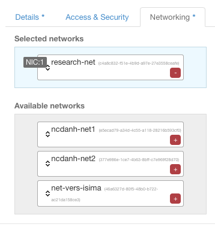

# Paramètres de base

La plateforme vous permet d'instancier plusieurs type d'OS. La première étape consiste donc à choisir ce dernier. Cliquez sur le menu de gauche sur l'entrée 'Images'. Cliquez ensuite sur le bouton 'Launch instance' situé en face de la distribution que vous aurez choisi.

Sur l'écran représenté ici, il suffit de saisir les éléments suivants :

* Zone de disponibilité, pour le moment il n'y en a qu'une : az1.
* Le nom de notre instance (qui sera le hostname de la VM)

Merci d'utiliser votre login comme préfixe aux noms de vos VM.
Exemple : "fgaudet_mysql-server"

* Le gabarit de la VM. A droite vous avez un panneau qui détaille la signification précise dudit gabarit en terme de CPU, RAM, disk etc...
* Le nombre d'instance que vous allez créer
* Laissez les deux derniers champs avec leur valeur par défaut, nous verrons plus tard comment les utiliser.
* Nous pouvons d'ors et déjà lancer lancer notre instance en cliquant sur 'Launch', mais voyons quelques paramètres supplémentaires. Cliquez sur l'onglet 'Access & Security'.

La liste déroulante vous permet de choisir la clé publique qui sera injectée "dans" la VM. Le groupe de sécurité représente les règles de firewall à appliquer à la VM. Ici, choisissez le groupe par défaut. Il ouvre en entrée seulement l'ICMP et le SSH. Nous verrons ultérieurement comment créer ses propres groupes de sécurité et comment modifier les règles.

L'onglet suivant vous permet de sélectionner les réseaux qui seront attachés à la VM. Dans cet exemple, il n'y en a qu'un. Il est sélectionné automatiquement par défaut.

En revanche, lorsque plusieurs réseaux sont définis, il est nécessaire d'en choisir explicitement au moins un pour booter la VM. Pour le projet 'petasky' par exemple, choisissez 'petasky-net'.

Evitez de créer votre instance en ajoutant le réseau 'net-vers-isima'. Faites-le dans un second temps une fois que la VM a démarré. (voir chapitre Prendre la main sur l'instance) 

# Paramètres optionnels

L'onglet post-creation permet de configurer la VM à l'issue du boot. L'idée ici est de passer des paramètres ou des commandes à cloud-init, le processus qui est lancé à la fin du boot de la VM, et dont nous avons déjà parlé. Cela sous présente sous la forme d'un script, téléchargeable ou que l'on peut éditer directement sur le formulaire. Le script en question débute forcément par la ligne `'#cloud-config'.

Dans l'exemple ci-après, les packages mentionnés seront installés à l'issue du boot de la VM.

Il est également possible de créer des utilisateurs, des groupes, d'exécuter des scripts... Voir le site de [cloud-init](https://cloudinit.readthedocs.org/en/latest/ "Cloud Init") pour plus d'info.