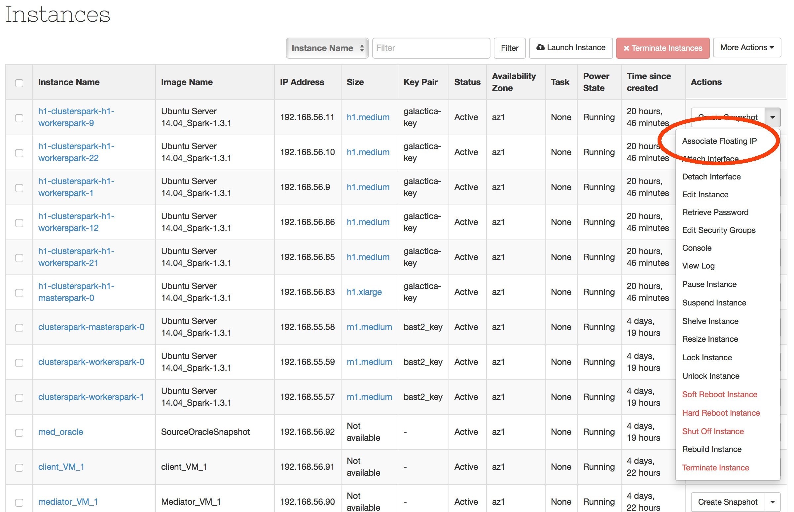
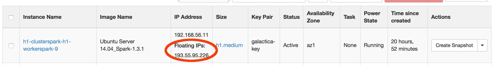

# Introduction

Vous pouvez prendre la main sur une instance de deux façons différentes.

* Par SSH
* Par la console

Si vous n'avez rien spécifié de particulier lors de l'instantiation, alors la seule manière dans un premier temps de prendre la main sur la VM est la méthode SSH. Pour prendre la main à partir de la console, il faut au préalable avoir créé un user local à cet effet.

# Accès SSH par floating IP

##Concept

Les floating IP sont des IP publiques que l'on peut associer à l'interface d'une VM afin de pourvoir accéder à la VM depuis l'extérieur.

##Mise en oeuvre

A partir du menu déroulant choisir l'option 'Associate Floating IP'.

Choisir l'IP à associer, cliquez sur 'Associate'.

La VM est désormais accessible via la floating IP depuis l'extérieur.

Vous pouvez dès lors créer un user local qui soit autorisé à se connecter à cette VM. Petit rappel : pour des raisons de sécurité il est absolument interdit d'utiliser le compte 'root' pour se connecter à distance. Vous pouvez alors libérer la floating IP.

# Accès via la console

**Après avoir créé un user local**, à partir du navigateur web, cliquez sur l'instance afin d'ouvrir l'écran qui détaille les caractéristiques de votre VM. Cliquez ensuite sur l'onglet 'Console'.

