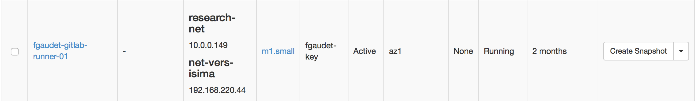
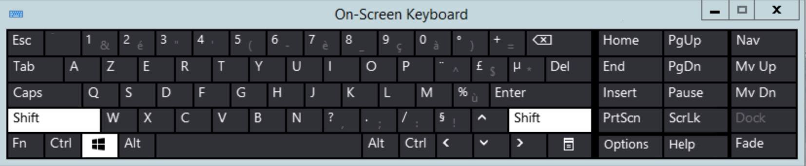

# Introduction

Vous pouvez prendre la main sur une instance de deux façons différentes.

* Par SSH
* Par la console

Si vous n'avez rien spécifié de particulier lors de l'instantiation, alors la seule manière dans un premier temps de prendre la main sur la VM est la méthode SSH. En effet pour prendre la main à partir de la console, il faut au préalable avoir créé un user local à cet effet.

Le username utilisé depend de la distribution. Sur ubuntu, le user par défaut est 'ubuntu'. Pour les distributions centos il s'agit de 'centos', pour CoreOS il s'agit de 'core'. Si vous utilisez d'autres types d'images, il faudra alors rechercher quel est le user défini par la distribution.

# Accès SSH

Pour se connecter en SSH, distinguons deux cas :

* Vous vous connectez depuis l'ISIMA
* Vous vous connectez depuis l'extérieur

L'ISIMA offre un accès direct aux VM depuis un réseau privé. En revanche si vous n'êtes pas physiquement à l'ISIMA, vous établissez une connection depuis l'extérieur, il vous faudra affecter une floating-ip.

##Connection depuis l'ISIMA

Depuis le menu contextuel de la VM, cliquez sur 'Attach Interface'. Choisissez le réseau appelé `net-vers-isima`. 

Si nécessaire rafraîchissez la page récapitulative des instances afin de voir apparaître l'adresse IP qui aura été automatiquement attribuée.

Vous pouvez maintenant passer à la section ci-dessous qui décrit la mise en oeuvre d'une connection SSH en fonction du type de client que vous utilisez.

##Connection depuis l'extérieur

A partir du menu déroulant choisir l'option 'Associate Floating IP'.

Choisir l'IP à associer, cliquez sur 'Associate'.

La VM est désormais accessible via la floating IP depuis l'extérieur.

Vous pouvez dès lors créer un user local qui soit autorisé à se connecter à cette VM. Petit rappel : pour des raisons de sécurité il est absolument interdit d'utiliser le compte 'root' pour se connecter à distance. Vous pouvez alors libérer la floating IP.

##Client Linux

Il suffit d'indiquer à SSH la localisation de la clé privée grâce à l'option `-i`.

ssh -i fgaudet-id_rsa ubuntu@193.55.95.226

##Client Windows

Un bon client SSH sous windows est le programme [putty](http://www.putty.org). Vous aurez besoin de 2 exécutables : `putty` et `puttygen`. En effet, putty utilise son propre format de clé privé imposant de ce fait la conversion de la clé SSH téléchargée depuis la plateforme grâce à `puttygen`.

###Conversion de la clé

Ouvrez l'utilitaire `puttygen.exe` et cliquez sur le bouton 'Load',

et sélectionnez votre clé privée SSH. Vous recevez lors la confirmation que votre clé a été chargée :

Ensuite, sauvegardez la clé en cliquant sur le bouton 'Save private key', 

répondez 'oui' à la question.

Choississez un nom approprié, et cliquez sur 'Enregistrer'.

###Configuration de putty

Ouvrez à présent putty, cliquez sur le menu 'Connection/data' et placez le username désiré dans le champ 'Auto-login username' :

Ensuite, ouvrez à partir du menu la section 'Auth', et remplissez le champ 'Private key file for authentication' :

Maintenant que les options sont définies, vous pouvez placer l'adresse IP de connection dans la section 'Session' et cliquez sur 'Open'

La première fois, il vous est proposé d'accepter la clé publique :

Cliquez sur 'Oui', vous avez maintenant un accès SSH fonctionnel :

# Accès par la console

**Après avoir créé un user local**, à partir du navigateur web, cliquez sur l'instance afin d'ouvrir l'écran qui détaille les caractéristiques de votre VM. Cliquez ensuite sur l'onglet 'Console'.

# Utilisation des claviers virtuels
Le clavier géré par l'accès console répond aux besoins de base, mais parfois vous allez avoir besoin d'uiliser des caractères un peu exotiques tels que le pipe "|", l'esperluette "&", mais que le clavier console ne sait pas gérer.

Une méthode toute simple consiste à utiliser les claviers virtuels founis par la plupart des desktops :

## Linux
Par exemple sous Ubuntu, l'utilitaire en question s'appelle `onboard`. Cliquez sur le caractère qui vous intéresse, et il sera inséré à l'endroit où se trouve votre pointeur.

## Windows
Sous Windows il s'appelle `osk` (comme On-Screen Keyboard).

