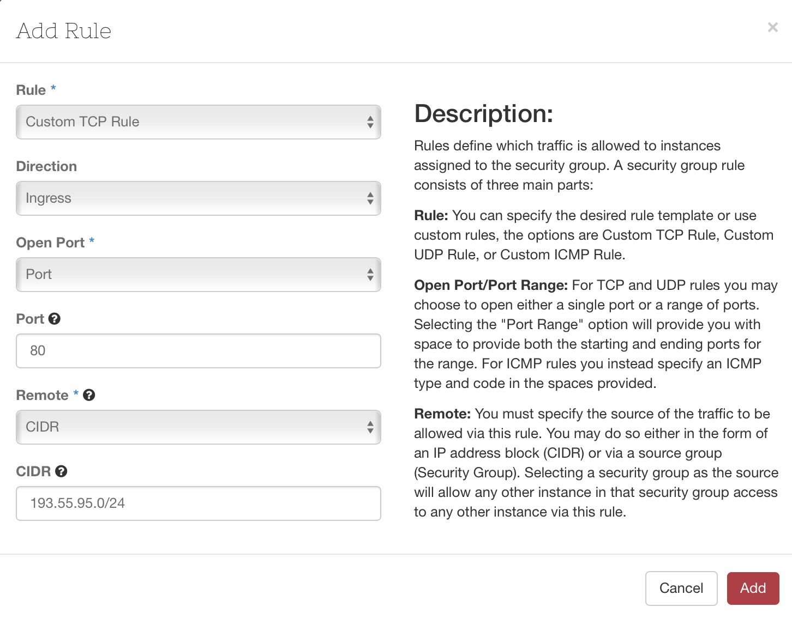
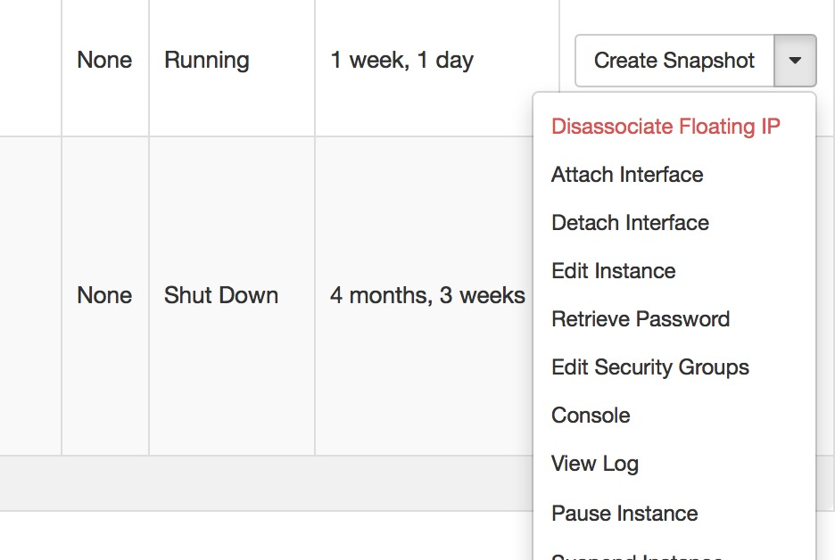
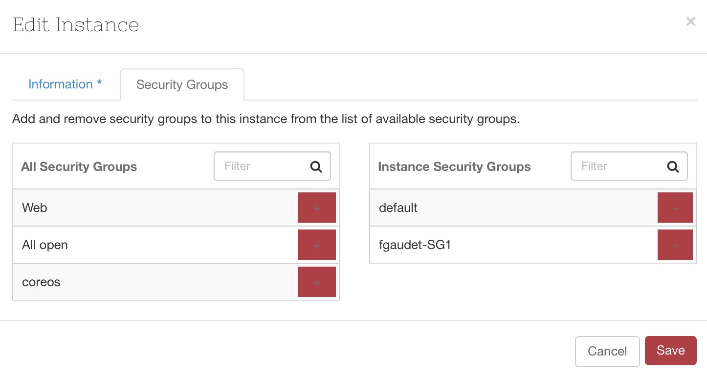
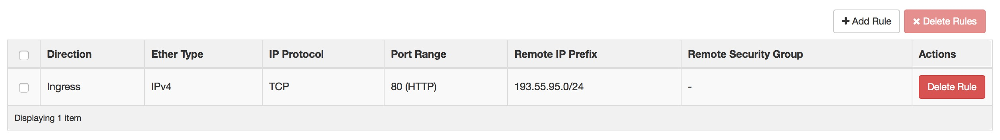
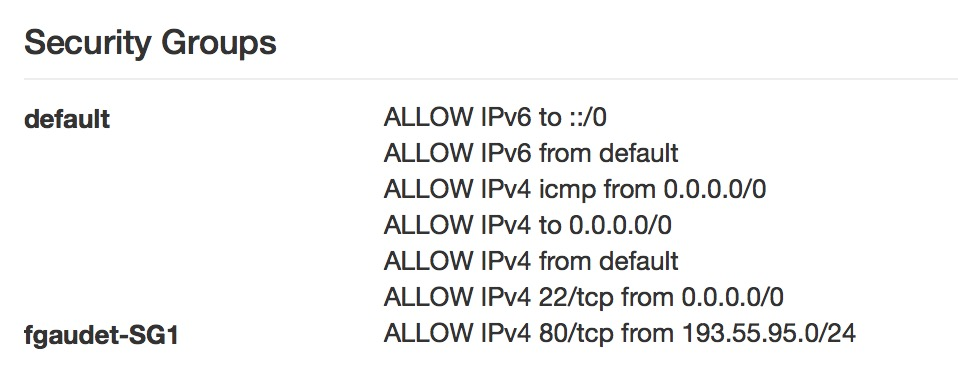

#Ouvrir des flux

##Principe

La sécurité est implémentée sur l'hyperviseur, la VM ne contient pas de firewall. Par défaut seul le port 22 (SSH) est ouvert. Si vous souhaitez ouvrir un autre port procédez ainsi :

##Création d'un groupe de sécurité

Menu 'Access & Security / Security Groups / Create Security Groups'
	
Entez un nom et une description, sur ce modèle :

`Nom : fgaudet-sg1`

`Description : For testing purposes`

Enlevez les rules de sorties (egress rules) qui sont déjà inclues dans le SG par défaut. 

## Ajoutez une règle

Pour ouvrir par exemple le port 80 pour les clients en provenance de 193.55.95.0/24, cliquez sur 'Add Rule' :

Répétez cette procédure pour chaque flux.

##Appliquez la(les) règle(s)

Une fois la (les) règle(s) créée(s), il faut l(les)'appliquer à notre VM. A partir du menu contextuel à droite de la VM, cliquez sur 'Edit Security Groups'

Cliquez sur le '+' en face du groupe de sécurité que vous voulez appliquer puis cliquer sur 'Save'. 

L'activation est immédiate, pas besoin de redémarrer la VM.

#Vérification

Finalement dans les propriétés de la VM, vérifiez que la nouvelle règle est bien appliquée :

