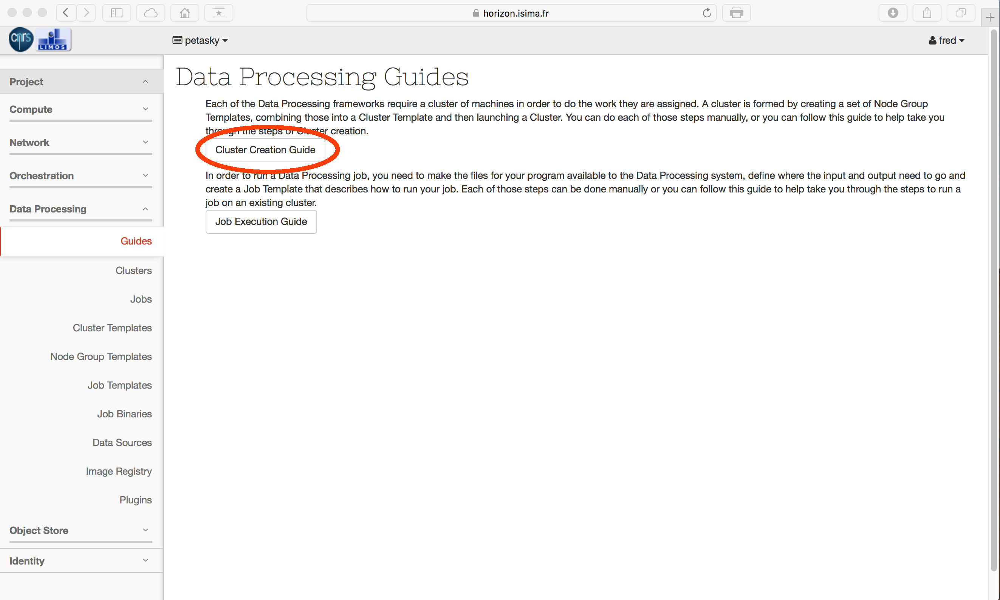
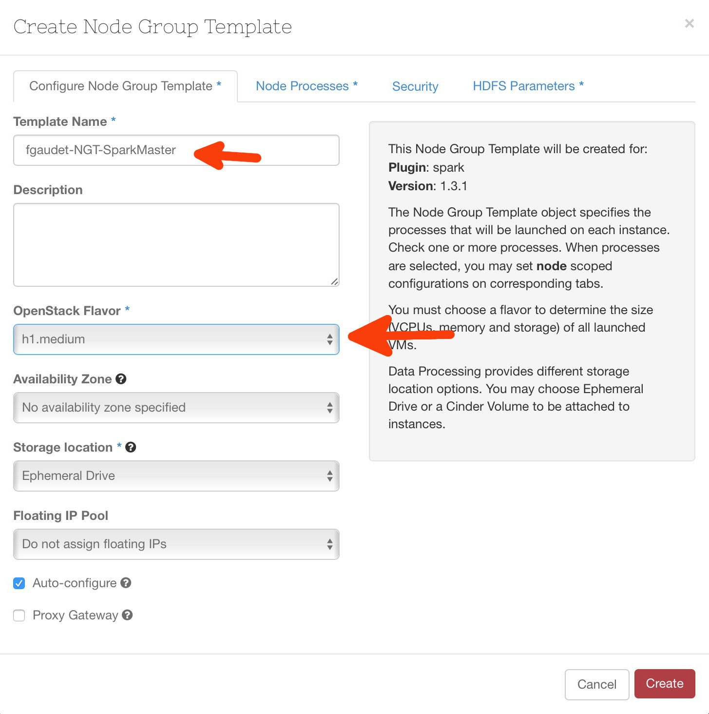
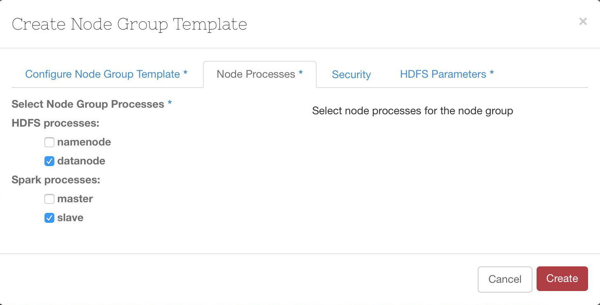
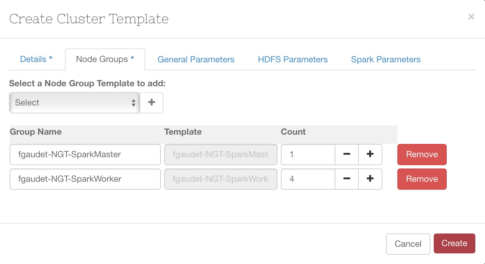
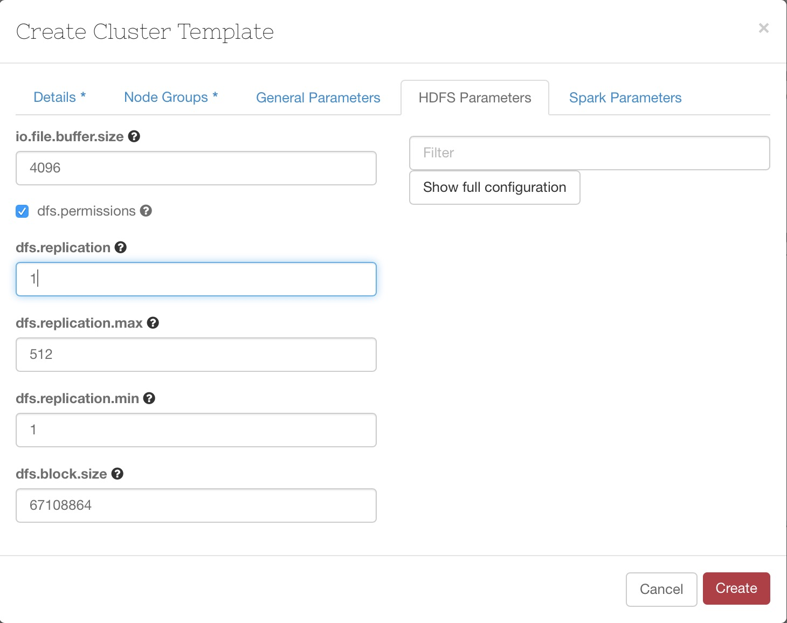
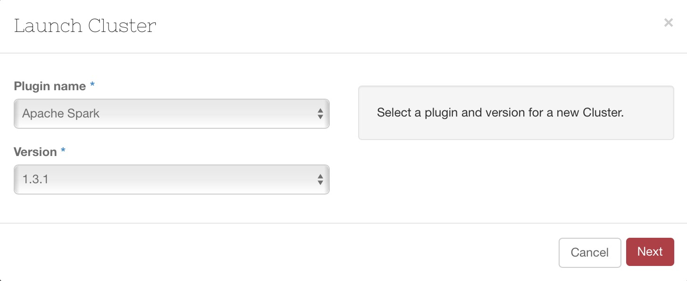
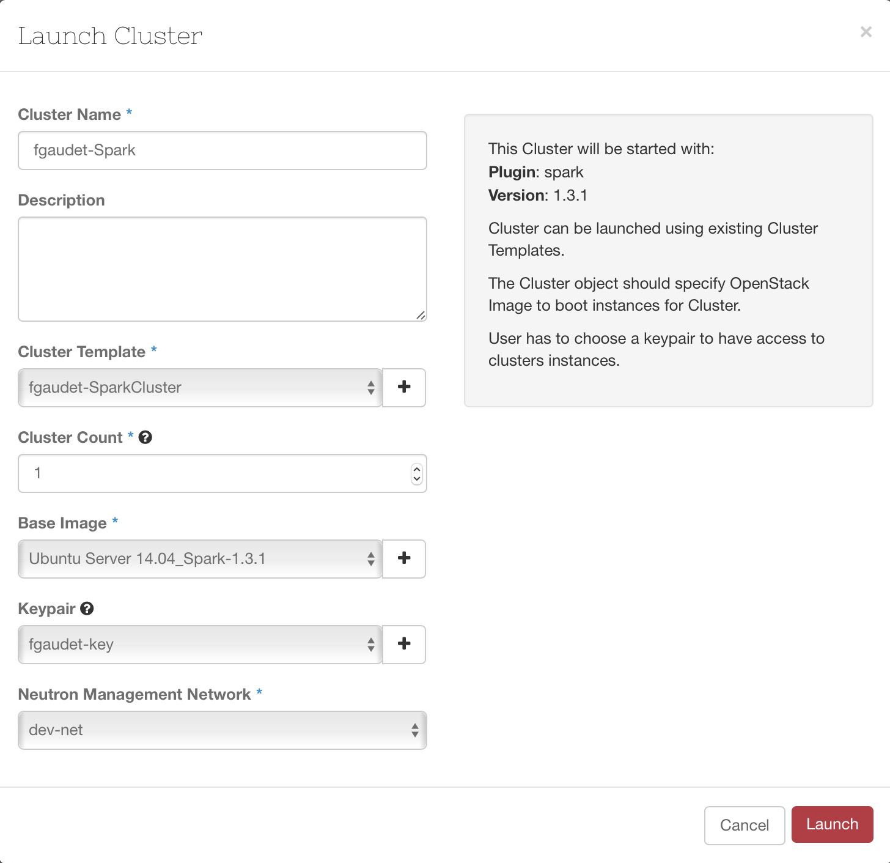
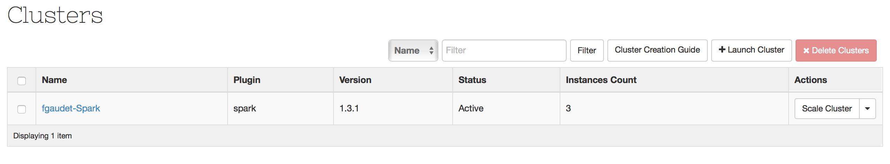

# Principe

La construction d'un cluster implique de suivre ces 4 étapes :


graph LR;
  A(Choix du plugin)-->B;
  B(Définition des \nmodèles de noeuds\nMaster et Workers)-->C;
  C(Définition  du modèle \nde cluster)-->D;
  D(Lancement du cluster);


Le plugin propose d'ailleurs une page qui permet d'enchainer ces étapes. Cliquez sur 'Cluster Creation Guide' dans le menu 'Data Processing' / 'Guides'.

# Choix du plugin

Cliquez sur 'Choose Plugin'

La liste déroulante présente les différents plugins avec leur version qui sont proposés par défaut par EDP :

* Vanilla Apache Hadoop
	* ~~2.6.0~~
	* 2.7.1
* Hortonworks Data Platform
	* 2.0.6
* Apache Spark
	* ~~1.0.0~~
	* 1.3.1
* Cloudera
	* ~~5~~
	* ~~5.3.0~~
	* 5.4.0

Sur galactica les versions non disponibles sont barrées. Au final, le plugin choisi s'affiche en vert en face de l'étape correspondante :

Nous allons continuer de dérouler le workflow avec un plugin Spark 1.3.1.

# Définition du modèle de noeud : Master

L'idée ici est de créer un modèle décrivant le gabarit de la VM, ainsi que les processus associés. Cliquez sur 'Create Master Node Group Template'. Un écran s'affiche :

Renseignez le nom du modèle, puis le gabarit à utiliser. 

Puis dans l'onglet 'Node Processes' vous cochez les processus que le plugin sera censé démarrer à l'issue de la création du cluster. Evidemment les processus présenté ici dépendent du plugin choisi : si nous avions choisi le plugin Hadoop, alors nous aurions les processsus 'Oozie', 'Resource Manager'... etc.

# Définition du modèle de noeud : Worker

Nous reprennons le même principe de construction que celui décrit ci-dessus. Cliquez sur 'Create Worker Node Group Template'. Un écran s'affiche :

A la différence du modèle Master, nous choisissons ici les processus 'datanode' et 'slave'.

Bien entendu, le gabarit dépend fortement de la quantité de donnée à traiter (nous pourrions ajouter du stockage sous forme de volumes) et même du type de plugin utilisé : Spark étant par nature du style 'In memory' il réclamera des workers avec une certaine quantité de mémoire par rapport à Hadoop MR.

# Création d'un modèle de cluster

Enfin, créons maintenant le modèle du cluster. 

Nous allons ensuite spécifier combien de noeuds composent notre cluster dans l'onglet 'Node Groups' :

L'onglet 'HDFS Parameters' permet d'accéder à de (très) nombreux paramètres. Ici nous allons définir la réplication à 1.

Cliquez sur 'Create', et ensuite passons à la dernière étape.

# Lancement d'un cluster

Dernière étape, et non des moindres : la création du cluster. Le plugin est déjà sélectionné, cliquez sur 'Next'.

Ici nous devons donner un nom au cluster. Seul ce champ est obligatoire. Toutefois je conseillerais de choisir une clé, si vous deviez vous connecter au cluster pour quelque raison que ce soit, il faudrait préalablement y avoir positionné une clé.

La création du cluster prend un certain temps. En effet, au delà de la création des instances, le plugin se connecte sur chaque VM afin de configurer le cluster et ensuite lancer les services. A l'issue de ce processus, le cluster se trouve dans l'état 'Active'.

